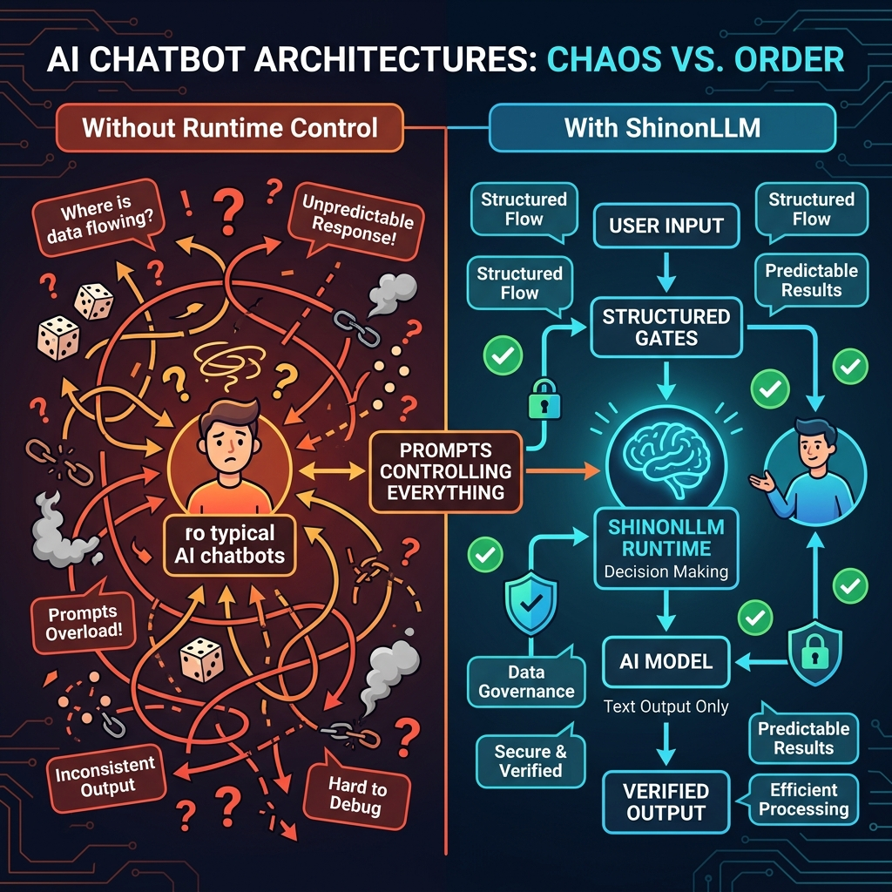
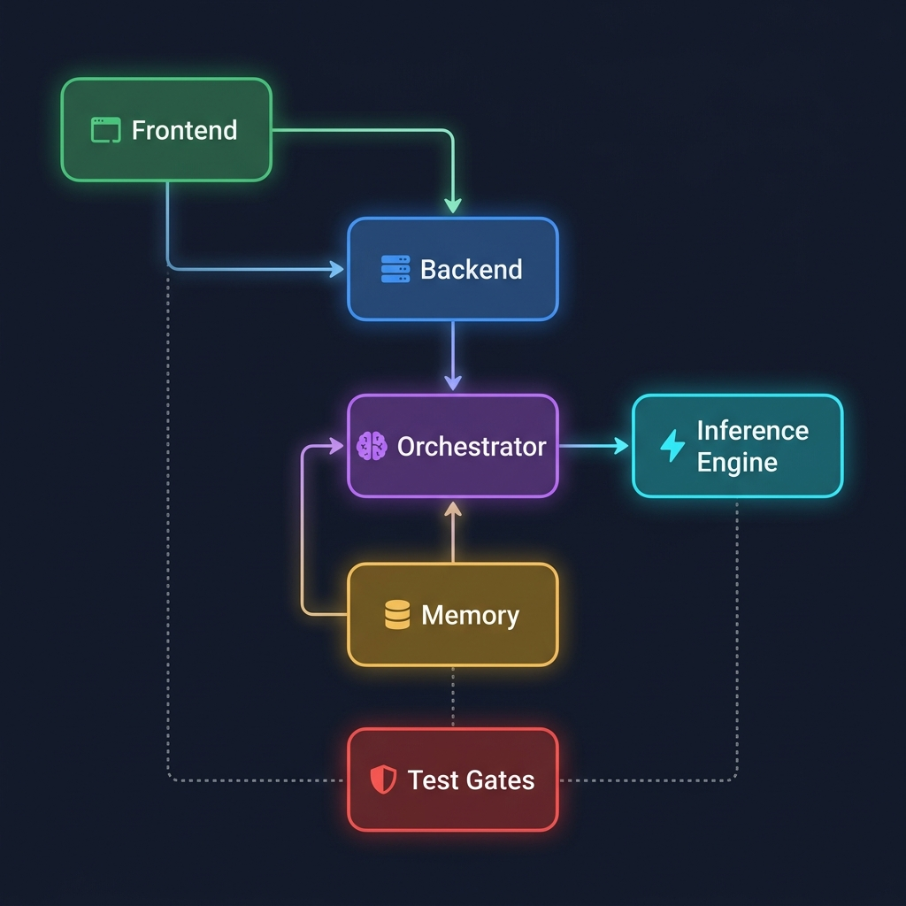

# ShinonLLM


**Die Runtime denkt. Das LLM formuliert Text.**

Release: **0.2.3** · [Changelog](./CHANGELOG.md) · [Apache-2.0](./LICENSE)

---

## Das Problem

Jeder kennt es: Du installierst einen AI-Chatbot, er ist am Anfang beeindruckend – und nach drei Tagen hast du das Gefühl, mit einem Fremden zu reden, der sich an nichts erinnert.



| | Typische AI-Produkte | ShinonLLM |
|---|---|---|
| **Wer entscheidet** | Das Modell (via Prompt) | Die Runtime (Code-Logik) |
| **Erinnerung** | Chat-Logs, die irgendwann verschwinden | Persistentes Scoring nach Häufigkeit & Impact |
| **Personalisierung** | "Stell dir vor, du bist..." | Echte Muster-Erkennung über die Zeit |
| **Kontrolle** | Prompt-Hoffnung | Fail-closed Gates & Contracts |
| **Deine Daten** | Cloud-Server eines Fremden | 100% lokal auf deiner Hardware |
| **Modell-Größe** | GPT-4, Claude, 70B+ | Kleine Modelle (0.5B–7B), getestet & optimiert |

---

## Was ist ShinonLLM?

ShinonLLM ist ein **lokal-erstes AI-System**, das aus deiner Nutzung lernt – ohne deine Daten jemals irgendwohin zu schicken.

> **Kein Wrapper. Kein API-Proxy. Eine eigenständige Runtime.**

### Die drei Säulen

```
┌─────────────────────────────────────────────────────────────┐
│                    🧠 Runtime (Entscheider)                 │
│  ┌──────────┐  ┌───────────┐  ┌──────────┐  ┌───────────┐  │
│  │ Contracts│→ │Orchestrator│→ │ Scoring  │→ │  Memory   │  │
│  │(Eingabe- │  │(Pipeline- │  │(Relevanz,│  │(Persistenz│  │
│  │ prüfung) │  │ steuerung)│  │ Frequenz,│  │ + Decay)  │  │
│  └──────────┘  └───────────┘  │ Impact)  │  └───────────┘  │
│                               └──────────┘                  │
├─────────────────────────────────────────────────────────────┤
│                    💬 LLM (Textformulierung)                │
│         Kleine, lokale Modelle – kein Cloud-Zwang           │
│              llama.cpp · Qwen · Ollama                      │
└─────────────────────────────────────────────────────────────┘
```

### Wie es funktioniert


---

## MVP-Scope vs. Langzeit-Vision

### 🎯 MVP (Aktueller Fokus)

Ein lokales AI-Modell, das **persistent vom Nutzer lernt** mit zwei Modi:

| Feature | Status | Beschreibung |
|---|:---:|---|
| Lokal-First Runtime | ✅ | Läuft auf deiner Hardware, keine Cloud |
| Kleine Modelle (0.5B–7B) | ✅ | llama.cpp mit Qwen 0.5B verifiziert |
| Session Memory + Persistence | ✅ | SQLite-Backend, TTL, Decay |
| Scoring Engine | ✅ | Relevanz × 0.7 + Intent × 0.2 + Recency × 0.05 |
| Token-Budget Management | ✅ | Bounded Context mit Token-Limits |
| Pattern-Analyse (Häufigkeit) | 🔧 | Token-Overlap Scoring existiert, Frequenz-Tracking geplant |
| Impact/Zeit-Scoring | 🔧 | Recency-Score existiert, Impact-Gewichtung geplant |
| Drift-Schutz | 📋 | Contract-Gates + Replay existieren, aber kein "Persona-Drift-Detection"-Modus |
| Frontend Chat UI | ✅ | Next.js, dark-themed, funktional |

### 🔭 Langzeit-Vision

| Feature | Scope | Beschreibung |
|---|---|---|
| **Real Persona** | Produkt | Nicht ein weiterer Wrapper – eine AI die dich *kennt* |
| **Developer IDE Integration** | Langzeit | In-Editor AI-Assistent mit Kontext aus dem laufenden Projekt |
| **Muster-Erkennung** | Produkt | Pattern-Analyse nach Häufigkeit und Impact, kein Raw-Data-Dump |
| **Multi-Modell Evaluation** | Intern | Welches kleine Modell liefert die besten Ergebnisse? Intern getestet |
| **Kontext-Token-Speicherung** | Produkt | Runtime verwaltet Tokens, nicht das Modell |

---

## Architektur



### Module

| Modul | Files | Zweck |
|---|:---:|---|
| `backend/` | 7 | HTTP-Server, Routing, Validation |
| `orchestrator/` | 7 | Pipeline-Steuerung, Contracts |
| `inference/` | 6 | Modell-Adapter (llama.cpp, Ollama), Retry |
| `memory/` | 5 | Session + Longterm Storage, Scoring, Retrieval |
| `frontend/` | 10 | Next.js Chat-UI |
| `tests/` | 9 | Gates, Unit, Integration, E2E |
| `shared/` | 4 | Utils (Hashing, Serialization) |
| `telemetry/` | 4 | Event + Replay Support |
| **Gesamt** | **52** | **TypeScript Source Files** |

### Scoring-Formel

Die Runtime bewertet Kontext-Einträge deterministisch nach:

```
score = relevance × 0.70        (Token-Overlap: User-Query vs. Entry)
      + intentMatch × 0.20      (Binär: mindestens 1 Token Match)
      + recency × 0.05          (Zeitstempel-Gewichtung)
      + structural × 0.05       (Hat ID/Type-Metadaten)
      + positionBonus × 0.01    (Index-Penalty: 1/(i+1))
```

> **Kein Raw-Data-Dump.** Die Runtime entscheidet was relevant ist – basierend auf messbaren Scores, nicht auf Prompt-Hoffnung.

### Test-Gates (Release-Qualität)

| Gate | Typ | Prüft |
|---|---|---|
| `contract-gate` | Gate | Schema-Konformität aller Contracts |
| `replay-gate` | Gate | Determinismus: gleicher Input → gleicher Output |
| `baseline-integrity` | Gate | Baseline-Hash-Konsistenz |
| `orchestrator` | Unit | Pipeline-Logik |
| `router` | Unit | Inference-Routing |
| `session-persistence` | Unit | Memory Persist/Load/Decay |
| `fallback` | Integration | Failover-Verhalten |
| `chat-flow` | Integration | End-to-End Chat-Pipeline |
| `chat-ui` | E2E | Frontend-Interaktion |

---

## Quickstart

```powershell
# Dependencies installieren
npm ci
npm --prefix frontend ci

# Verification-Suite
npm run verify:backend
npm --prefix frontend run build

# Lokal starten
npm run start:local

# Stoppen
npm run stop:local
```

---

## Warum "Shinon"?

Die meisten AI-Produkte sind glänzende Oberflächen über Cloud-APIs. Du schickst deine Daten weg und hoffst, dass das Modell sich an dich erinnert. Tut es nicht.

**ShinonLLM dreht das um:**

- 🏠 **Lokal:** Deine Daten bleiben auf deiner Maschine
- 🧠 **Persistent:** Die Runtime lernt von dir, über Sessions hinweg
- 📊 **Scoring statt Raten:** Kontext-Auswahl basiert auf echten Metriken, nicht auf Prompt-Tricks
- 🔒 **Kontrolliert:** Fail-closed Gates, Contract-Validation, deterministische Pipelines
- 🪶 **Klein:** Optimiert für 0.5B–7B Modelle die auf Consumer-Hardware laufen

---

## Documentation

- [docs/README.md](./docs/README.md) – Docs Navigation Hub
- [docs/ARCHITECTURE_OVERVIEW.md](./docs/ARCHITECTURE_OVERVIEW.md) – Architektur-Deep-Dive
- [docs/MEMORY_POLICY.md](./docs/MEMORY_POLICY.md) – Memory Policy (SQLite, TTL, Decay)
- [docs/HANDSHAKE_CURRENT_STATE.md](./docs/HANDSHAKE_CURRENT_STATE.md) – Aktueller Handshake-Stand
- [docs/TODO.md](./docs/TODO.md) – Priorisierter Backlog

## Contributing & Security

- [CONTRIBUTING.md](./CONTRIBUTING.md)
- [SECURITY.md](./SECURITY.md)

## Source of Truth

`README.md` ist Präsentations-Layer, nicht Source of Truth. Autoritative Referenzen:

- [LLM_ENTRY.md](./LLM_ENTRY.md)
- [docs/HANDSHAKE_CURRENT_STATE.md](./docs/HANDSHAKE_CURRENT_STATE.md)
