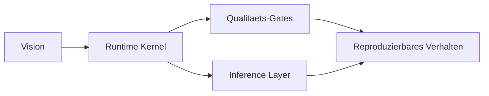

# ShinonLLM

GitHub-Repository zur Vorstellung einer local-first LLM-Runtime mit Fokus auf Nachvollziehbarkeit, Determinismus und kontrollierte Weiterentwicklung.

## Vision (Endzustand)

ShinonLLM soll als verlassliche Runtime dienen, bei der Verhalten nicht erraten werden muss: Eingaben, Entscheidungen und Ergebnisse bleiben pruefbar und reproduzierbar.

## Produktidee in einem Satz

Ein **Deterministic Local LLM Runtime Kernel (Contract-First)** fuer reale Workflows statt Black-Box-Demo.

## Aktueller Stand

| Bereich | Stand |
|---|---|
| Backend-Routen (`/health`, `/chat`) | Implemented |
| Contract-Gates (`tests/gates/*`) | Implemented |
| Determinismus-/Replay-Gates | Implemented |
| Inference-Adapter (`ollama`, `llama.cpp`) | Implemented |
| End-to-End Standardpfad mit Live-Inference | Partially integrated |
| GitHub-Repo-Praesentation | In progress |

## Current vs. Target Behavior

- Current behavior: stabiler Runtime-Kern mit Gates; Inference ist vorhanden, aber nicht durchgaengig der Default-Pfad.
- Target behavior: klarer Standardfluss von Request -> Orchestrator -> Inference -> Response mit transparenter Verifikation.

## 5-Minuten-Quickstart (nur fuer Repo-Besucher)

Voraussetzung: Node.js LTS installiert.

```powershell
npm install
cd frontend; npm install; cd ..
npm run verify:backend
```

Erwartung:
- Gate- und Backend-Checks laufen erfolgreich durch.
- Danach kann die Runtime lokal gestartet und weiter evaluiert werden.

## Was als Naechstes fehlt

- sichtbare CI-Checks im Repo (GitHub Actions)
- klarerer Live-Run-Pfad fuer Inference als Default
- produktnahe Betriebsdoku statt nur Contract-Snippets

## Projektbild



```text
Vision -> Kernel -> Gates + Inference -> reproduzierbares Verhalten
```

## Ueber mich

Ich baue ShinonLLM als langfristiges Projekt mit klarem Anspruch: robuste Basis, ehrliche Darstellung des Ist-Zustands und iterative Produktreife.

## Source-of-Truth Hierarchie

`README.md` ist **nicht** Source of Truth.

Verbindlich sind:
- [LLM_ENTRY.md](./LLM_ENTRY.md) (Aenderungs- und Integrationsregeln)
- [docs/LLM_ENTRY_CONFORMITY.md](./docs/LLM_ENTRY_CONFORMITY.md) (Konformitaetsrahmen)
