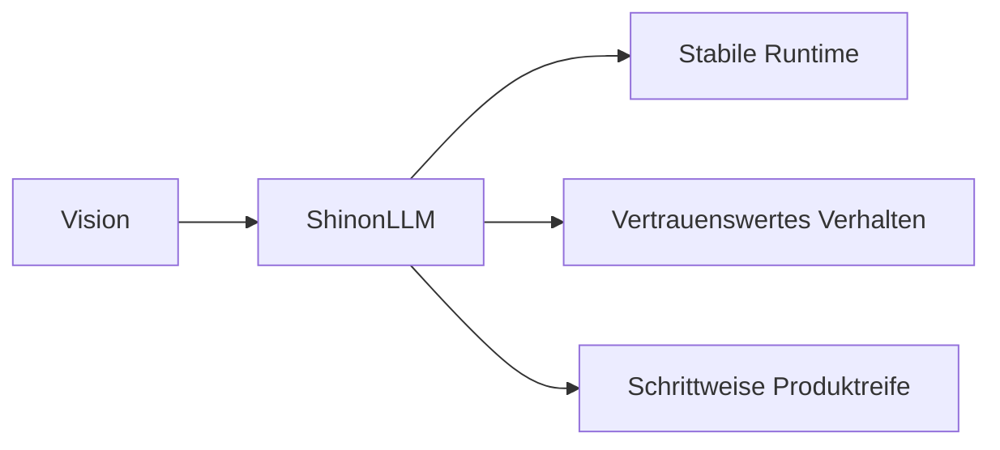

# ShinonLLM

ShinonLLM ist ein Projekt fuer eine verlassliche, lokal kontrollierbare KI-Runtime mit klarem Fokus auf Stabilitaet, Nachvollziehbarkeit und saubere Weiterentwicklung.

## Einfuehrung

Dieses Repository zeigt, wie wir ShinonLLM als ernsthafte Produktbasis aufbauen: kein Show-Prototype, sondern ein System, das in echten Workflows tragfaehig werden soll.

## Was wir planen

- Ein konsistentes Nutzererlebnis von Anfrage bis Antwort
- Eine klare Produktlinie von lokalem Betrieb bis strukturierter Auslieferung
- Eine belastbare Qualitaetskultur, die vor Geschwindigkeit kommt

## Was wir haben

- Eine funktionierende Runtime-Basis mit klarer Modulstruktur
- Verbindliche Qualitaets-Gates fuer reproduzierbares Verhalten
- Ein Repository, das als saubere Projektgrundlage dient

## Was noch fehlt

- Produktreife End-to-End Nutzerfuehrung
- Staerkere Praesentation fuer reale Use Cases und Demos
- Kontinuierliche Politur fuer Team- und Release-Prozesse

## Projektbild



```text
Idee -> Struktur -> Stabilitaet -> Vertrauen -> Produkt
```

## Ueber mich

Ich entwickle ShinonLLM mit dem Anspruch, ein robustes und ehrlich praesentiertes Projekt zu bauen: klar in der Richtung, diszipliniert in der Umsetzung und offen fuer konsequente Verbesserung.

## Wichtiger Vermerk

`README.md` ist keine Source of Truth.  
Verbindlich sind:

- [LLM_ENTRY.md](./LLM_ENTRY.md)
- [docs/LLM_ENTRY_CONFORMITY.md](./docs/LLM_ENTRY_CONFORMITY.md)
