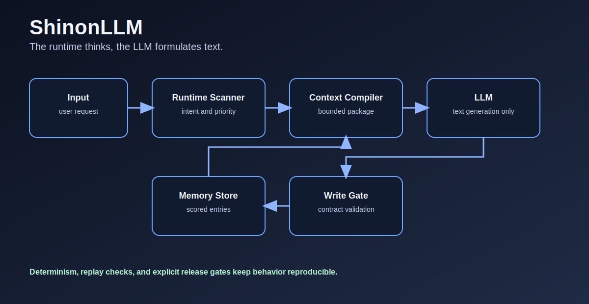

# ShinonLLM

Release: **0.2.3** (Package `0.2.3`)

## Core Principle

**The runtime thinks, the LLM formulates text.**

ShinonLLM is a runtime-first local LLM stack. Decision logic, memory policy, scoring, and write constraints belong to runtime code, not model improvisation.

## Current Product Frame

- Runtime-owned flow: `backend -> orchestrator -> inference -> memory`.
- Deterministic quality gates: contract + replay + baseline integrity.
- Live inference path with mandatory offline evaluator evidence.
- Session persistence with explicit decay path.



## Quickstart

```powershell
npm install
npm --prefix frontend install
npm run test:determinism
npm run verify:backend
npm --prefix frontend run build
```

Optional local run:

```powershell
npm run start:local
```

Stop stack:

```powershell
npm run stop:local
```

## Single Documentation Truth

Documentation was consolidated. Current truth is maintained in:

- [docs/HANDSHAKE_CURRENT_STATE.md](./docs/HANDSHAKE_CURRENT_STATE.md)
- [docs/DETERMINISTISCHES_LLM_RUNTIME_KONZEPT.md](./docs/DETERMINISTISCHES_LLM_RUNTIME_KONZEPT.md)
- [docs/TODO.md](./docs/TODO.md)
- [docs/releases/VERSIONING.md](./docs/releases/VERSIONING.md)
- [docs/releases/RELEASE_PROCESS.md](./docs/releases/RELEASE_PROCESS.md)
- [CHANGELOG.md](./CHANGELOG.md)

## Source of Truth

`README.md` is not source of truth.

Authoritative references:

- [LLM_ENTRY.md](./LLM_ENTRY.md)
- [docs/LLM_ENTRY_CONFORMITY.md](./docs/LLM_ENTRY_CONFORMITY.md)
- [docs/HANDSHAKE_CURRENT_STATE.md](./docs/HANDSHAKE_CURRENT_STATE.md)
