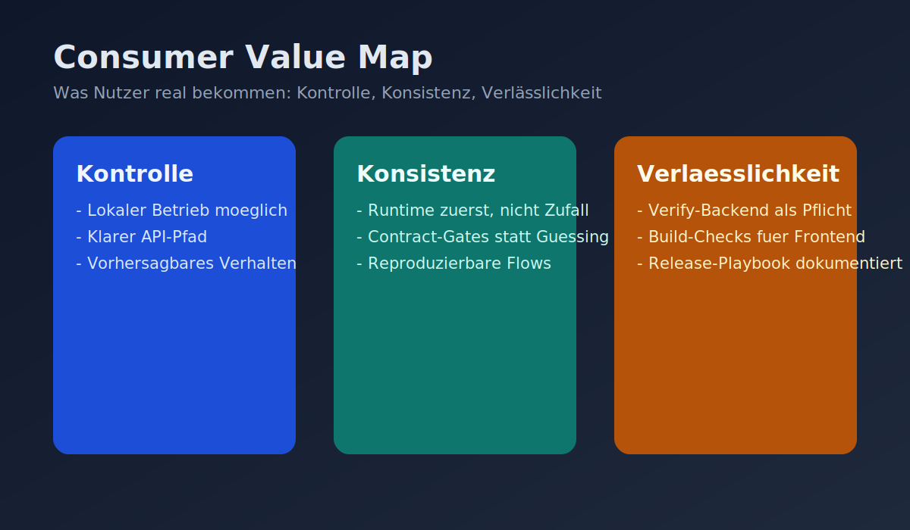
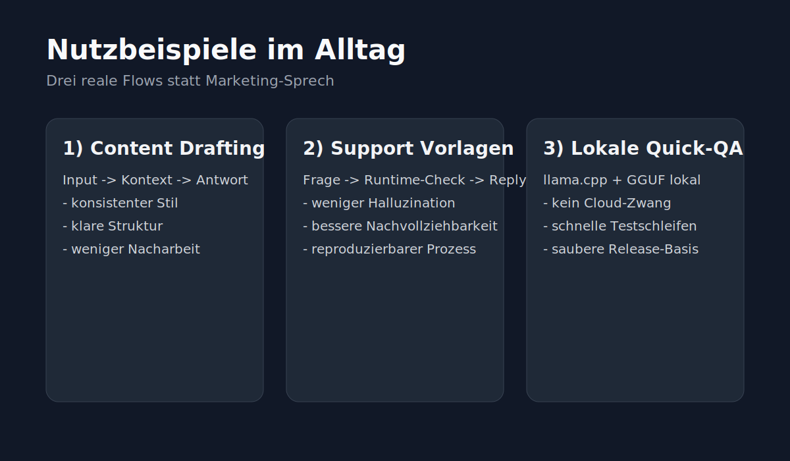
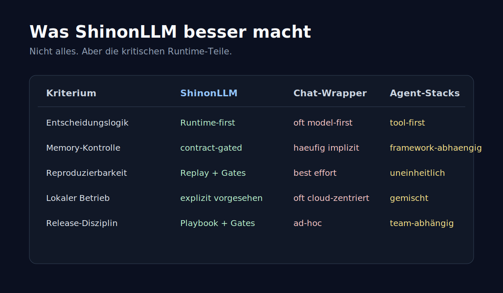
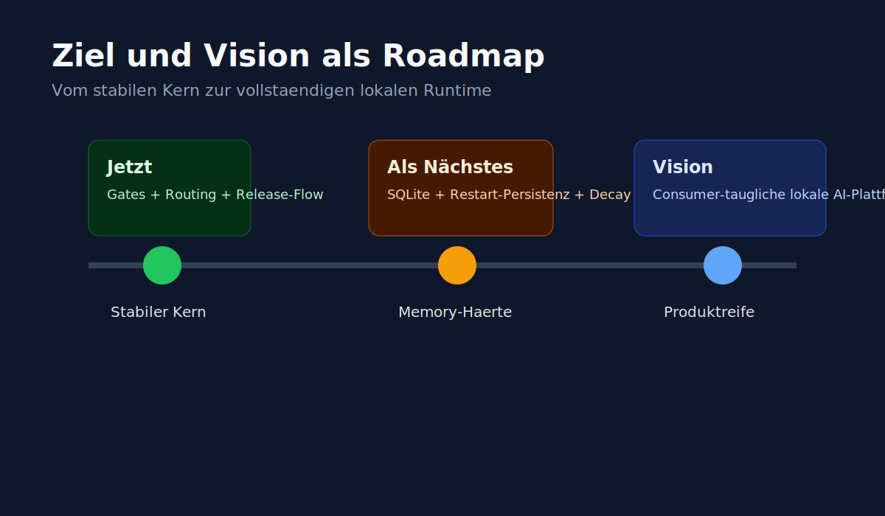

# ShinonLLM

## Consumer-Teil (Produkt zuerst)

### Was ShinonLLM ist
ShinonLLM ist eine lokale Web-App fuer KI-gestuetzte Antworten mit einem klaren Grundprinzip:
**Die Runtime steuert die Logik, das Modell formuliert den Text.**

Das ist kein kosmetischer Satz. Das ist der Unterschied zwischen "mal gut, mal wild" und einem System, das sich in echten Workflows kontrolliert verhaelt.



### Warum das fuer dich wichtig ist
Viele KI-Setups wirken am Anfang stark und kippen dann in drei Probleme: unklare Entscheidungen, driftendes Memory und schlechte Nachvollziehbarkeit.
ShinonLLM setzt genau dort an.

1. **Mehr Kontrolle**
- Lokaler Betrieb ist vorgesehen.
- Verhalten wird ueber Runtime-Regeln und klare Pfade gesteuert.

2. **Mehr Konsistenz**
- Antworten entstehen aus kuratiertem Kontext statt aus wachsender Prompt-Unordnung.
- Zentrale Pruefpfade reduzieren "heute so, morgen anders".

3. **Mehr Verlaesslichkeit**
- Verifikation ist Teil des Workflows (`verify:backend`, Frontend-Build).
- Releases folgen einem dokumentierten Prozess statt Ad-hoc-Pushes.

### Konkrete Nutzbeispiele



#### Beispiel 1: Content-Entwurf mit stabilem Stil
Du willst Texte, die sich wie aus einem Guss lesen.
ShinonLLM hilft, weil die Runtime den Kontext sauber haelt und nicht jeder Turn den Stil neu verwuerfelt.

#### Beispiel 2: Support-Antworten mit weniger Chaos
Du brauchst kurze, klare Antworten fuer wiederkehrende Themen.
Durch strukturierte Eingabepfade und Guardrails sinkt das Risiko von inkonsistenten Antworten.

#### Beispiel 3: Lokale Quick-QA ohne Cloud-Zwang
Du willst schnell pruefen, ob dein Prompt/Use Case funktioniert.
Mit lokalem `llama.cpp`-Setup kannst du direkt testen, ohne von externen Plattformbedingungen abzuhaengen.

### Was ShinonLLM besser macht (ohne Marketing-Maerchen)



ShinonLLM ist nicht "in allem besser".
ShinonLLM ist in den **kritischen Runtime-Themen** besser aufgestellt:

- **Entscheidungsautoritaet:** Runtime-first statt model-first.
- **Memory-Kontrolle:** contract-gated statt impliziter Nebenwirkungen.
- **Reproduzierbarkeit:** Replay/Gates statt "best effort".
- **Release-Disziplin:** dokumentierter Prozess statt Trial-and-Error.

### Person hinter dem Projekt
Ich bin **Felix Vannon**.
ShinonLLM ist mein Versuch, KI aus dem Hype-Modus in einen produktiven Modus zu bringen:
weniger Show, mehr Systemhaerte.

### Ziel und Vision



**Ziel (nah):**
Eine lokale Web-App, die in echten Aufgaben stabil nutzbar ist.

**Vision (mittel/lang):**
Eine consumer-taugliche lokale AI-Plattform, bei der Kontrolle und Nachvollziehbarkeit kein Extra sind, sondern Standard.

---

## Dev-Teil (technisch)

### Projektphilosophie
**The runtime thinks, the LLM formulates text.**

Praktisch bedeutet das:
- Runtime entscheidet ueber Kontext, Priorisierung und zugelassene Operationen.
- Model-Output wird eingegrenzt und geprueft.
- Fail-closed und Determinismus sind keine Nebensache, sondern Kernprinzip.

### Architektur
- `backend/`: HTTP-Entry, Route-Verhalten
- `orchestrator/`: Contracts, Prompt-Building, Guardrails, Routing
- `inference/`: Adapter (`ollama`, `llama.cpp`)
- `memory/`: Session/Longterm-Retrieval und Store-Bausteine
- `telemetry/`: Replay/Hash/Evidence
- `tests/`: Gates, Unit, Integration


### Technische Vergleiche zu anderen Loesungen

| Bereich | ShinonLLM | Typische Chat-Wrapper | Typische Agent-Stacks |
|---|---|---|---|
| Entscheidungslogik | Runtime-first | oft model-first | haeufig tool-first |
| Memory-Writes | contract-gated | oft implizit | framework-abhaengig |
| Reproduzierbarkeit | Replay + Gates | best effort | uneinheitlich |
| Lokaler Betrieb | explizit vorgesehen | oft cloud-zentriert | gemischt |
| Release-Haerte | Playbook + Gates | oft ad-hoc | team-abhängig |

### Aktueller Status (ehrlich)
- Solider Runtime-/Contract-/Gate-Basiskern vorhanden.
- API-Pfadvereinheitlichung fuer `/api/chat` und `/api/health` ist umgesetzt (kompatible Aliase vorhanden).
- Lokaler `llama.cpp` Quick-QA Pfad ist dokumentiert und skriptbar.
- Naechste harte Ausbaustufe bleibt: produktive SQLite-Persistenz + Decay im Laufzeitpfad.

### Quickstart
Voraussetzung: Node.js LTS

```powershell
npm install
cd frontend; npm install; cd ..
npm run verify:backend
cd frontend; npm run build; cd ..
```

Lokaler `llama.cpp` Setup:
- [docs/LOCAL_LLAMACPP_SETUP.md](./docs/LOCAL_LLAMACPP_SETUP.md)

Release-Ablauf auf GitHub:
- [docs/GITHUB_RELEASE_PLAYBOOK.md](./docs/GITHUB_RELEASE_PLAYBOOK.md)

### Dokumentation
- [docs/README.md](./docs/README.md)
- [docs/TARGET_SYSTEM_OVERVIEW.md](./docs/TARGET_SYSTEM_OVERVIEW.md)
- [docs/DETERMINISTISCHES_LLM_RUNTIME_KONZEPT.md](./docs/DETERMINISTISCHES_LLM_RUNTIME_KONZEPT.md)
- [docs/releases/RELEASE_PROCESS.md](./docs/releases/RELEASE_PROCESS.md)
- [CHANGELOG.md](./CHANGELOG.md)

### Source of Truth
`README.md` ist Einstieg und Produktdarstellung, nicht alleinige technische Wahrheit.

Autoritative Referenzen:
- [LLM_ENTRY.md](./LLM_ENTRY.md)
- [docs/LLM_ENTRY_CONFORMITY.md](./docs/LLM_ENTRY_CONFORMITY.md)
- [docs/DETERMINISTISCHES_LLM_RUNTIME_KONZEPT.md](./docs/DETERMINISTISCHES_LLM_RUNTIME_KONZEPT.md)
