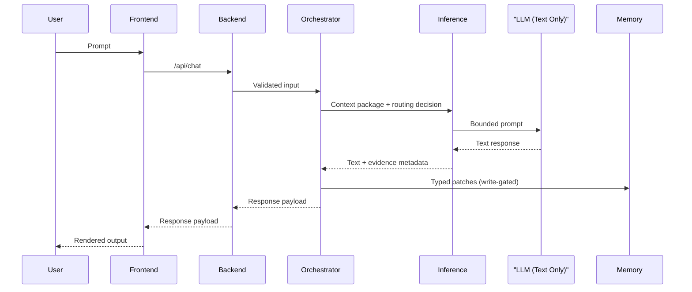

# Architecture Overview

This document is an orientation layer.
For the verified current state, treat [HANDSHAKE_CURRENT_STATE.md](./HANDSHAKE_CURRENT_STATE.md) as authoritative.

## The One Rule

The runtime thinks. The LLM formulates text.

In practice, this means:

- Runtime code owns contracts, routing, scoring, and memory writes.
- The model is treated as a text engine, not as a state machine.
- Any state mutation is explicit, typed, and validated by gates (fail-closed).

## Components

- `frontend/`: Delivery surface (UI), no policy ownership.
- `backend/`: HTTP boundary, request validation, fail-closed routing.
- `orchestrator/`: Turn orchestration, contracts, action gating.
- `inference/`: Model execution adapters and routing.
- `memory/`: Typed session/long-term memory primitives (scoring/decay).
- `telemetry/`: Replay support and determinism artifacts.
- `tests/`: Unit/integration/e2e and gate checks (contract/replay/baseline).

## Memory policy reference

Detailed runtime memory behavior (TTL, decay retention, SQLite opt-in, and fail-closed rules) is maintained in:

- [MEMORY_POLICY.md](./MEMORY_POLICY.md)

## Hot Path (Request/Response)

## Quality Gates (Release Handshake)

ShinonLLM treats determinism and contract integrity as release conditions:

- Contract gate ensures input/output schemas match the declared contracts.
- Replay gate ensures identical inputs reproduce identical replay hashes and action sequences.
- Baseline integrity ensures the expected deterministic baseline is stable across runs.

See [docs/releases/RELEASE_PROCESS.md](./releases/RELEASE_PROCESS.md) for the operational checklist.
