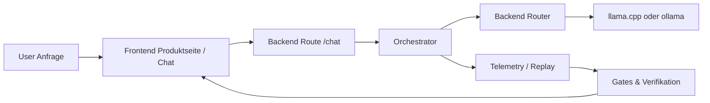

# ShinonLLM Manual

Dieses Manual ist die technische Begleitdokumentation zur Produktseite.

## Verbindlichkeit

`README.md` dient **nicht** als Source of Truth.  
Verbindlich sind:

1. `LLM_ENTRY.md`
2. die Gate- und Test-Definitionen unter `tests/`
3. die Runtime-Vertraege in den jeweiligen Modulen

## Einfuehrung

ShinonLLM verfolgt einen kontrollierten Runtime-Ansatz: gleiche Eingaben sollen reproduzierbar gleiche Ergebnisse liefern, und jede Erweiterung muss ueber klar sichtbare Gates laufen.

## Was wir planen

- Live-Betrieb mit konfigurierbarer Modellstrategie (`llama.cpp`, `ollama`, Fallbacks)
- konsistente Produktpfade vom User-Input bis zur Antwort
- stabile Release-Routine mit festen Checks vor jedem Push

## Was wir haben

- deterministische Gate-Tests (`contract-gate`, `replay-gate`)
- funktionierende Backend-Routen (`/health`, `/chat`)
- produktionsfaehigen Frontend-Build
- modulare Runtime-Struktur fuer orchestrator/inference/memory/telemetry

## Was noch fehlt

- vollstaendige Live-Politur fuer Modellbetrieb und Monitoring
- tiefere UX-Iteration fuer Session- und Verlaufserlebnisse
- standardisierte Betriebsdokumente fuer Team-Scaling

## Ablaufmodell (Mermaid)



## ASCII Uebersicht

```text
+-----------------------------+
|         SHINONLLM           |
+-----------------------------+
            |
            v
  [Frontend Erlebnis]
            |
            v
   [Backend + Orchestrator]
            |
            v
   [Inference / Model Layer]
      |                 |
      v                 v
 [llama.cpp]       [ollama]
            |
            v
   [Telemetry + Gates]
            |
            v
     [Release-Freigabe]
```

## Umsetzung ohne Overload

Wir halten die Produktseite absichtlich nicht zu technisch.  
Die Seite soll Orientierung geben, Vertrauen aufbauen und den Plan zeigen.  
Technische Tiefe bleibt hier im Manual, damit Kommunikation und Engineering sauber getrennt sind.

