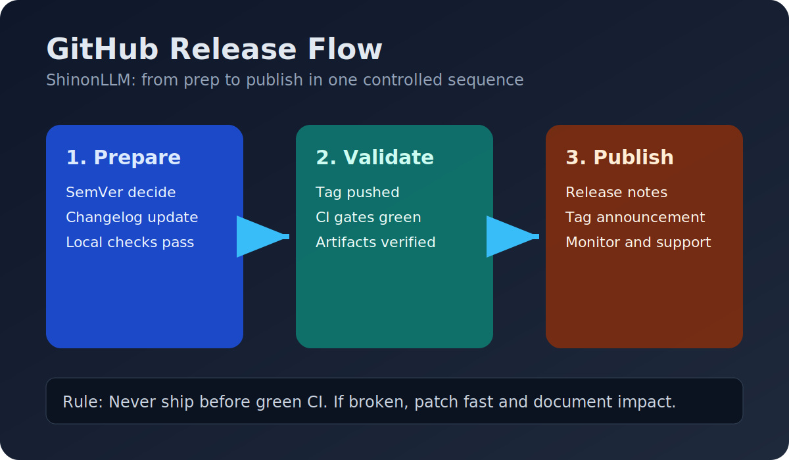
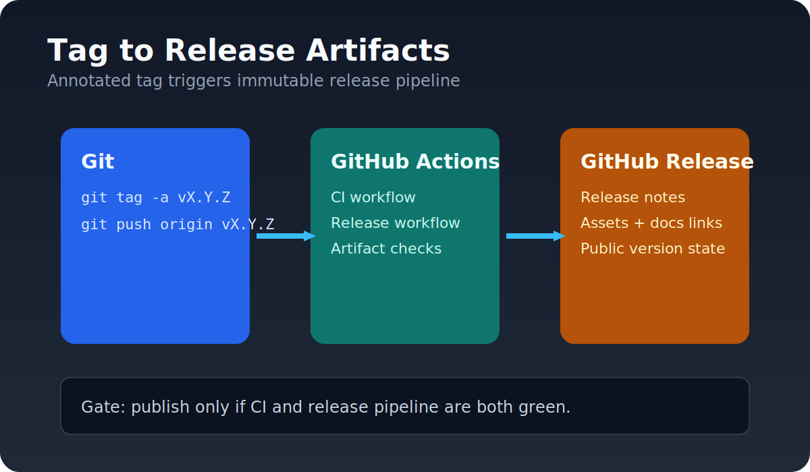
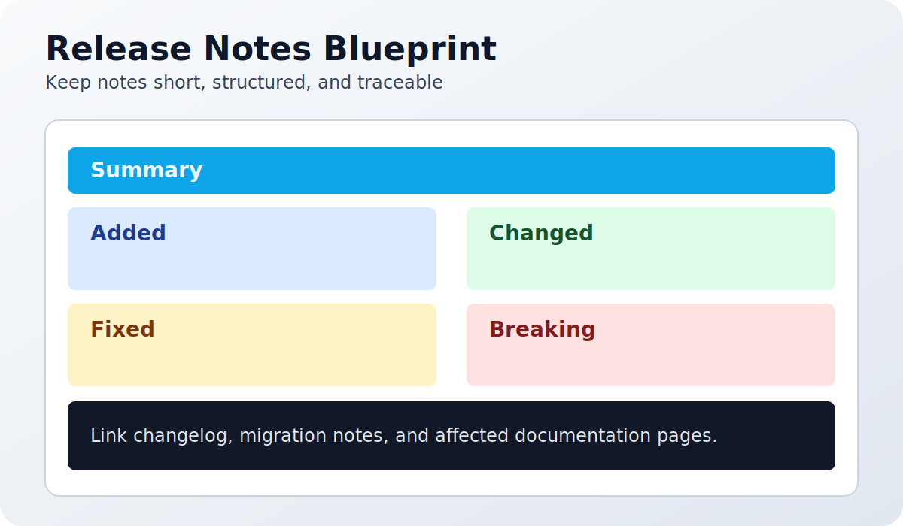
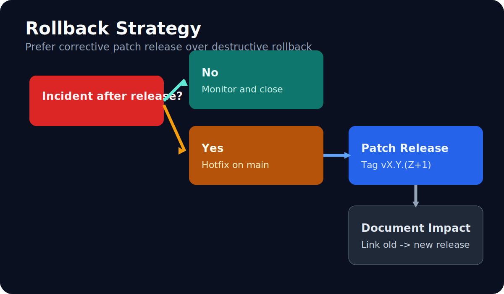
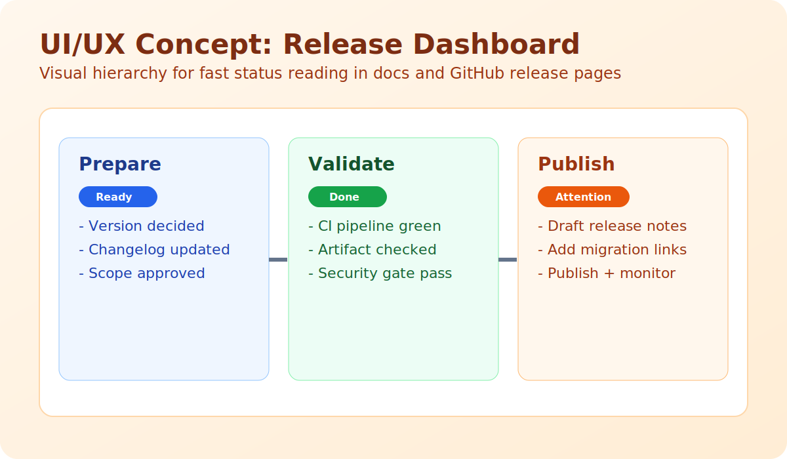

# Documentation Index

This folder contains product, architecture, and operational documentation for ShinonLLM.

## Start Here

- [PRODUCT_POSITIONING.md](./PRODUCT_POSITIONING.md)
- [TARGET_SYSTEM_OVERVIEW.md](./TARGET_SYSTEM_OVERVIEW.md)
- [DETERMINISTISCHES_LLM_RUNTIME_KONZEPT.md](./DETERMINISTISCHES_LLM_RUNTIME_KONZEPT.md)

## Release and Versioning

- [releases/VERSIONING.md](./releases/VERSIONING.md)
- [releases/RELEASE_PROCESS.md](./releases/RELEASE_PROCESS.md)
- [GITHUB_RELEASE_PLAYBOOK.md](./GITHUB_RELEASE_PLAYBOOK.md)
- [../CHANGELOG.md](../CHANGELOG.md)

## Release Visual Assets

- [assets/release-flow.svg](./assets/release-flow.svg)
- [assets/release-tag.svg](./assets/release-tag.svg)
- [assets/release-notes.svg](./assets/release-notes.svg)
- [assets/release-rollback.svg](./assets/release-rollback.svg)
- [assets/release-uiux-concept.svg](./assets/release-uiux-concept.svg)
- [assets/consumer-value-map.svg](./assets/consumer-value-map.svg)
- [assets/user-journeys.svg](./assets/user-journeys.svg)
- [assets/shinon-vs-alternatives.svg](./assets/shinon-vs-alternatives.svg)
- [assets/vision-roadmap.svg](./assets/vision-roadmap.svg)

### Preview

## Governance and Conformity

- [../LLM_ENTRY.md](../LLM_ENTRY.md)
- [LLM_ENTRY_CONFORMITY.md](./LLM_ENTRY_CONFORMITY.md)
- [LOCAL_LLAMACPP_SETUP.md](./LOCAL_LLAMACPP_SETUP.md)

## Legacy/Technical Contract Files

The following files are kept for compatibility and implementation context:

- `ARCHITECTURE`
- `API_CONTRACT`
- `OPERATIONS`
