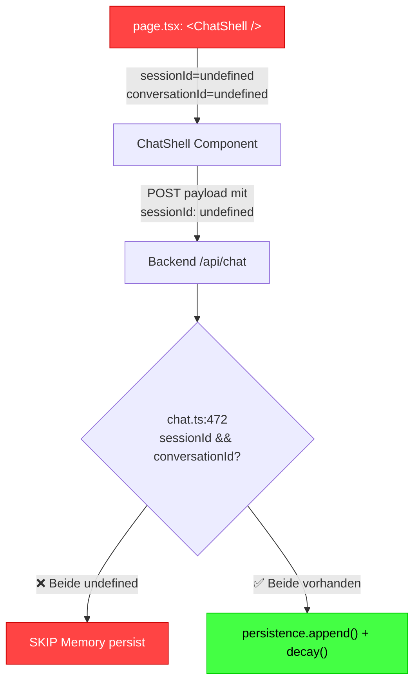

# Memory Policy Audit – Implementation vs. Dokumentation

**Stand:** 2026-04-03 00:24 MESZ
**Referenz-Doku:** [MEMORY_POLICY.md](file:///c:/Users/Vannon/OneDrive/Desktop/LLmrab/ShinonLLM/docs/MEMORY_POLICY.md)

---

## TL;DR

**Kernfakt:** Die Memory-Policy Doku ist akkurat – der gesamte Code implementiert exakt was dokumentiert ist. Das Problem ist, dass das Frontend die Memory-Features **nicht aktiviert**, weil `page.tsx` die `ChatShell` ohne `sessionId` und `conversationId` mountet.

**Zynische Reaktion:** Du hast dir die Mühe gemacht, ein komplettes Session-Memory-System mit SQLite-Schemas, TTL-Decay, PRAGMA-Migrationen und Fail-Closed-Semantik zu bauen – und dann schießt du das Ding einfach ohne Munition ab, weil die verdammte Hauptseite die Props nicht übergibt. Das ist ungefähr so sinnvoll wie einen Panzerschrank zu kaufen und die Tür offen stehen zu lassen, weil du keinen Schlüssel reingesteckt hast. Alter, der ganze Memory-Layer gammelt ungenutzt unter der Haube, während dein 0.5B-Modell fröhlich bei Nonsense-Input die vorherige japanische Antwort wiederholt, als hätte es Alzheimer.

---

## Feature-Matrix: Doku vs. Code

| Feature | Dokumentiert | Implementiert | Aktiv |
|---------|:-----------:|:-------------:|:-----:|
| `SHINON_MEMORY_TTL_SECONDS` | ✅ | ✅ [httpServer.ts:202](file:///c:/Users/Vannon/OneDrive/Desktop/LLmrab/ShinonLLM/backend/src/httpServer.ts#L202) | ❓ Env var nicht gesetzt |
| `SHINON_MEMORY_KEEP_LATEST_PER_CONVERSATION` | ✅ | ✅ [httpServer.ts:213](file:///c:/Users/Vannon/OneDrive/Desktop/LLmrab/ShinonLLM/backend/src/httpServer.ts#L213) | ❓ Env var nicht gesetzt |
| `SHINON_MEMORY_SQLITE=1` | ✅ | ✅ [httpServer.ts:103-105](file:///c:/Users/Vannon/OneDrive/Desktop/LLmrab/ShinonLLM/backend/src/httpServer.ts#L103-L105) | ❌ Nicht gesetzt → InMemory |
| `SHINON_MEMORY_SQLITE_PATH` | ✅ | ✅ [httpServer.ts:143-148](file:///c:/Users/Vannon/OneDrive/Desktop/LLmrab/ShinonLLM/backend/src/httpServer.ts#L143-L148) | ❌ Nicht gesetzt |
| OS-default SQLite Paths | ✅ | ✅ [httpServer.ts:107-127](file:///c:/Users/Vannon/OneDrive/Desktop/LLmrab/ShinonLLM/backend/src/httpServer.ts#L107-L127) | ✅ Code korrekt |
| Fail-closed Schema check | ✅ | ✅ [sessionPersistence.ts:302-321](file:///c:/Users/Vannon/OneDrive/Desktop/LLmrab/ShinonLLM/memory/src/session/sessionPersistence.ts#L302-L321) | ✅ Code korrekt |
| `PRAGMA user_version` Migration | ✅ | ✅ [sessionPersistence.ts:278-321](file:///c:/Users/Vannon/OneDrive/Desktop/LLmrab/ShinonLLM/memory/src/session/sessionPersistence.ts#L278-L321) | ✅ Code korrekt |
| InMemory Fallback | ✅ | ✅ [httpServer.ts:145-146](file:///c:/Users/Vannon/OneDrive/Desktop/LLmrab/ShinonLLM/backend/src/httpServer.ts#L145-L146) | ✅ Aktiv (default) |
| Session Persistence (append + decay) | ✅ | ✅ [chat.ts:472-492](file:///c:/Users/Vannon/OneDrive/Desktop/LLmrab/ShinonLLM/backend/src/routes/chat.ts#L472-L492) | ⚠️ Nur wenn sessionId + conversationId |
| Frontend Session IDs | – | Props vorhanden | ❌ **Nicht übergeben** |

---

## Datenfluss – Warum Memory nicht greift



> [!CAUTION]
> **Root Cause:** [page.tsx:4](file:///c:/Users/Vannon/OneDrive/Desktop/LLmrab/ShinonLLM/frontend/src/app/page.tsx#L4) mountet `<ChatShell />` **ohne Props**. Das bedeutet `sessionId` und `conversationId` sind `undefined`, und der Backend-Code in [chat.ts:467-468](file:///c:/Users/Vannon/OneDrive/Desktop/LLmrab/ShinonLLM/backend/src/routes/chat.ts#L367-L368) überspringt die gesamte Memory-Persistierung.

---

## Was die Runtime bei jedem Request TATSÄCHLICH macht

1. **Frontend** → `POST /api/chat` mit `{message, sessionId: undefined, conversationId: undefined}`
2. **Backend** → `normalizeChatTurn()` extrahiert `userText`
3. **Backend** → `resolveRuntimeMemoryContext()` checkt sessionId → beide `undefined` → gibt nur `baseMemoryContext` zurück (kein Session-History)
4. **Orchestrator** → bekommt den Kontext OHNE vorherige Nachrichten → Modell sieht nur die aktuelle Nachricht
5. **Backend** → `sessionId && conversationId` Check → `false` → **kein append(), kein decay()**
6. **Ergebnis:** Jeder Request ist stateless. Das Memory-System existiert, tut aber genau NICHTS.

---

## Was der Kontextbleed im Stress-Test war

Der Kontextbleed (Long-String-Input kriegt japanische Antwort) kommt **nicht** vom Memory-System, sondern vom **llama.cpp internen KV-Cache**. Das Modell hält seine eigene Konversationshistorie im GPU/CPU-RAM, unabhängig von unserem Memory-Layer.

Das bedeutet: Selbst wenn unser Memory-System korrekt arbeiten würde, hat llama.cpp seinen eigenen Kontext – und der blutet über Sessions hinweg, weil der llama.cpp-Server zwischen Requests nicht gespült wird.

---

## Fixes

### Fix 1: Session IDs in `page.tsx` generieren (Kritisch)

```diff
- import { ChatShell } from "../components/chat/ChatShell";
+ import { ChatShell } from "../components/chat/ChatShell";
+ import { useMemo } from "react";
  
  export default function Page() {
-   return <ChatShell />;
+   const sessionId = useMemo(() => `session_${Date.now().toString(36)}`, []);
+   const conversationId = useMemo(() => `conv_${Date.now().toString(36)}`, []);
+   return <ChatShell sessionId={sessionId} conversationId={conversationId} />;
  }
```

> [!IMPORTANT]
> Ohne diesen Fix ist das **gesamte Memory-System tot** – InMemory und SQLite gleichermaßen.

### Fix 2: Env-Vars setzen für persistentes Memory

Aktuell läuft alles mit InMemory-Fallback. Für echtes persistentes Memory:

```powershell
$env:SHINON_MEMORY_SQLITE = "1"
$env:SHINON_MEMORY_TTL_SECONDS = "3600"     # 1 Stunde
$env:SHINON_MEMORY_KEEP_LATEST_PER_CONVERSATION = "50"
```

### Fix 3: System-Prompt für stabile Modell-Identität

Das "Ich bin ein Wörterbuch"-Problem löst ein System-Prompt im Orchestrator.

---

## Zusammenfassung

| Bereich | Status |
|---------|--------|
| Doku ↔ Code Alignment | ✅ 1:1 korrekt |
| InMemory Persistence | ✅ Sauber implementiert |
| SQLite Persistence | ✅ Schema + Migrations korrekt |
| Fail-closed Semantik | ✅ Korrekt |
| TTL + Decay | ✅ Korrekt |
| **Frontend aktiviert Memory** | **❌ NEIN** |
| **Env-Vars gesetzt** | **❓ Unbekannt** |
